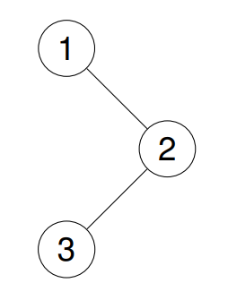
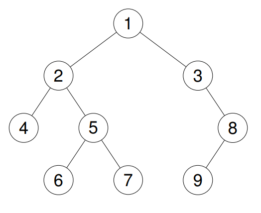

# 94. Binary Tree Inorder Traversal

**Difficulty:** Easy  
**Topics:** Tree, Depth-First Search, Stack, Binary Tree  
**Link:** [LeetCode Problem](https://leetcode.com/problems/binary-tree-inorder-traversal/)

## Problem Description

Given the `root` of a binary tree, return the inorder traversal of its nodes' values.

### Examples

**Example 1:**
```
    1
     \
      2
     /
    3

Input: root = [1,null,2,3]
Output: [1,3,2]
```




**Example 2:**
```
Input: root = []
Output: []
```



**Example 3:**
```
Input: root = [1]
Output: [1]
```

### Constraints

- The number of nodes in the tree is in the range `[0, 100]`.
- `-100 <= Node.val <= 100`

## Approach

### Tree Traversal Types

There are three common depth-first traversal patterns:
- **Inorder:** Left → Node → Right
- **Preorder:** Node → Left → Right
- **Postorder:** Left → Right → Node

### Recursive Approach

Inorder traversal follows the pattern: always go left first, then visit the node, then go right.

**Algorithm:**
1. If the node is null, return (base case)
2. Recurse on the left subtree
3. Add the current node's value to the result
4. Recurse on the right subtree

**Walkthrough:**
```
        4
       / \
      2    6
     / \  / \
    1   3 5   7

Start at 4 → go left to 2 → go left to 1
1 has no left → visit 1 → no right
Back to 2 → visit 2 → go right to 3
3 has no left → visit 3 → no right
Back to 4 → visit 4 → go right to 6
6 go left to 5 → visit 5 → no right
Back to 6 → visit 6 → go right to 7
7 has no left → visit 7 → no right

Result: [1, 2, 3, 4, 5, 6, 7]
```

**Key Insight:** Inorder traversal of a Binary Search Tree always produces values in sorted order!

**Time Complexity:** O(n) - Visit every node once  
**Space Complexity:** O(n) - Recursion stack in worst case (skewed tree), O(log n) for balanced tree

## Solutions

- [Python Solution](./python/solution.py)
- [TypeScript Solution](./typescript/solution.ts)

## Key Takeaways

- Inorder traversal (Left → Node → Right) is one of the three fundamental tree traversal patterns
- Recursive solution naturally mirrors the traversal definition
- Inorder traversal of a BST produces sorted output — useful for validating BSTs
- Understanding traversal patterns is foundational for more complex tree problems