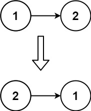

# 206. Reverse Linked List

**Difficulty:** Easy  
**Topics:** Linked List, Recursion  
**Link:** [LeetCode Problem](https://leetcode.com/problems/reverse-linked-list/)

## Problem Description

Given the `head` of a singly linked list, reverse the list, and return the reversed list.

### Examples

**Example 1:**


```
Input: head = [1,2,3,4,5]

1 → 2 → 3 → 4 → 5

Output: [5,4,3,2,1]

5 → 4 → 3 → 2 → 1
```

**Example 2:**



```
Input: head = [1,2]

1 → 2

Output: [2,1]

2 → 1
```

**Example 3:**
```
Input: head = []
Output: []
```

### Constraints

- The number of nodes in the list is in the range `[0, 5000]`.
- `-5000 <= Node.val <= 5000`

**Follow up:** A linked list can be reversed either iteratively or recursively. Could you implement both?

## Understanding the Problem

In a singly linked list, each node only has a `next` pointer that points forward. There's no way to go backwards! So we need to **reverse the arrows** themselves.

**Before:**
```
1 → 2 → 3 → 4 → 5 → null
```

**After:**
```
null ← 1 ← 2 ← 3 ← 4 ← 5
(or written the other way)
5 → 4 → 3 → 2 → 1 → null
```

We physically change each node's `next` pointer to point to the previous node instead of the next node.

## Approach

### Iterative Solution (Three Pointers)

Use three pointers to track the previous node, current node, and next node as you traverse the list. At each step, reverse the current node's pointer.

**Algorithm:**
1. Initialize `prev = null` (the new end of the list)
2. Initialize `current = head` (start at the beginning)
3. While current is not null:
   - Save the next node: `next = current.next`
   - Reverse the pointer: `current.next = prev`
   - Move prev forward: `prev = current`
   - Move current forward: `current = next`
4. Return `prev` (the new head)

**Example Walkthrough for `[1, 2, 3]`:**
```
Initial:
prev = null, current = 1 → 2 → 3

Step 1:
next = 2 (save it)
1.next = null (reverse arrow)
prev = 1, current = 2
Result: null ← 1    2 → 3

Step 2:
next = 3 (save it)
2.next = 1 (reverse arrow)
prev = 2, current = 3
Result: null ← 1 ← 2    3

Step 3:
next = null (save it)
3.next = 2 (reverse arrow)
prev = 3, current = null
Result: null ← 1 ← 2 ← 3

Return prev (which is 3, the new head)
```

**Time Complexity:** O(n) - Visit each node once  
**Space Complexity:** O(1) - Only using three pointers

## Solutions

- [C# Solution](./csharp/Solution.cs)
- [Python Solution](./python/solution.py)
- [TypeScript Solution](./typescript/solution.ts)

## Key Takeaways

- Singly linked lists only have forward pointers - you can't traverse backwards
- Reversing requires changing each node's `next` pointer to point to the previous node
- Three pointers (prev, current, next) are needed to avoid losing references
- Always save the next node before reversing the pointer
- The iterative approach is more intuitive than the recursive approach for this problem