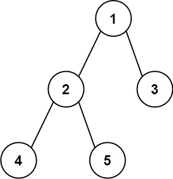

# 543. Diameter of Binary Tree

**Difficulty:** Easy  
**Topics:** Tree, Depth-First Search, Binary Tree  
**Link:** [LeetCode Problem](https://leetcode.com/problems/diameter-of-binary-tree/)

## Problem Description

Given the `root` of a binary tree, return the length of the **diameter** of the tree.

The **diameter** of a binary tree is the length of the longest path between any two nodes in a tree. This path may or may not pass through the root.

The length of a path between two nodes is represented by the number of **edges** between them.

### Examples

**Example 1:**



```
        1
       / \
      2   3
     / \
    4   5

Input: root = [1,2,3,4,5]
Output: 3
Explanation: The longest path is [4,2,1,3] or [5,2,1,3], which has 3 edges.
```

**Example 2:**
```
Input: root = [1,2]
Output: 1
```

### Constraints

- The number of nodes in the tree is in the range `[1, 10^4]`.
- `-100 <= Node.val <= 100`

## Approach

### DFS with Depth Tracking

The key insight is that the diameter at any node equals the **left depth + right depth**. The longest path doesn't always go through the root, so we check the diameter at every node and track the maximum.

**Key Insight:** This builds directly on Maximum Depth of Binary Tree (#104). At each node we calculate depth, but we also use left + right depths to update our diameter.

**Algorithm:**
1. Create a variable to track the maximum diameter
2. Write a recursive depth function that for each node:
   - Gets the depth of the left subtree
   - Gets the depth of the right subtree
   - Updates the max diameter with `left depth + right depth`
   - Returns the depth of this node (`1 + max(left, right)`)
3. Return the maximum diameter

**Walkthrough:**
```
        1
       / \
      2   3
     / \
    4   5

Start at node 1, go left to node 2, go left to node 4

Node 4: left = 0, right = 0
  diameter here = 0 + 0 = 0, max = 0
  return depth = 1

Node 5: left = 0, right = 0
  diameter here = 0 + 0 = 0, max = 0
  return depth = 1

Node 2: left = 1 (from 4), right = 1 (from 5)
  diameter here = 1 + 1 = 2, max = 2
  return depth = 1 + max(1, 1) = 2

Node 3: left = 0, right = 0
  diameter here = 0 + 0 = 0, max = 2
  return depth = 1

Node 1: left = 2 (from 2), right = 1 (from 3)
  diameter here = 2 + 1 = 3, max = 3
  return depth = 1 + max(2, 1) = 3

Answer: 3
```

**Why check every node?** Consider this tree:
```
        1
       /
      2
     / \
    3   4
   /     \
  5       6
```
The longest path is [5,3,2,4,6] = 4 edges, which passes through node 2, NOT the root.

**Time Complexity:** O(n) - Visit every node once  
**Space Complexity:** O(n) - Recursion stack in worst case (skewed tree), O(log n) for balanced tree

## Solutions

- [Python Solution](./python/solution.py)
- [TypeScript Solution](./typescript/solution.ts)

## Key Takeaways

- Diameter at any node = left depth + right depth
- The longest path doesn't always pass through the root — must check every node
- Builds directly on the Maximum Depth (#104) pattern with one extra step
- Using a closure variable to track the max across recursive calls is a common DFS technique